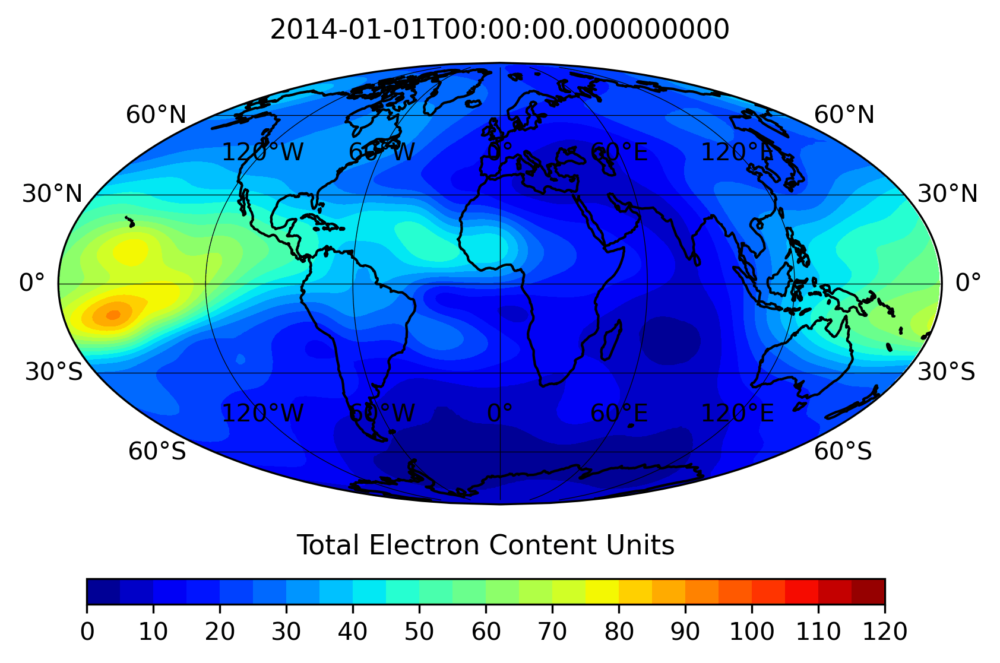

# Predictions of equatorial vertical plasma drift using TEC data and a neural network model
> SA Reddy, X Pi, C Forsyth, A Aruliah, A Smith. Earth and Space Science 12 (6), e2024EA004167

## Overview
The motion of plasma is responsible for transporting particles and energy from one region of Earth's ionosphere to another, changing its state, characteristics, and behavior. Over the years, studies have aimed to predict this plasma motion (drift), but most have focused on climatological patterns rather than daily or weather variations. To address this, the Vertical drIfts: Predicting Equatorial ionospheRic dynamics (VIPER) model has been developed. VIPER is a machine learning model that is trained on total electron content (TEC) data to predict the vertical plasma drift observed by the C/NOFS mission from 2009 to 2015. The uniqueness of VIPER is that it uses TEC data for the prediction, offers longitudinally global coverage, and includes robust uncertainty estimation capabilities.

<p align="center">
  
</p>


## Features
- 🥇 VIPER is the first model to address daily predictions of vertical plasma drift on a global scale
- ⚙️ The VIPER model is based on a multi-layer perceptron architecture and has uncertainty quantification built-in
- 📊 Trained on ~930k samples of data from the C/NOFS mission across the period 2009–2015
  
## Use
Users can access the trained VIPER model by pulling the repo and running ```run_model.ipynb```. When installed correctly, this reproduces Figure 8 in the manuscript.

For further information, please see the corresponding manuscript: [VIPER Study](https://agupubs.onlinelibrary.wiley.com/doi/10.1029/2024EA004167 "Load VIPER Study").

2025-07-23

